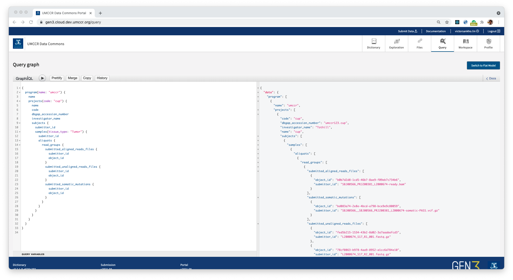
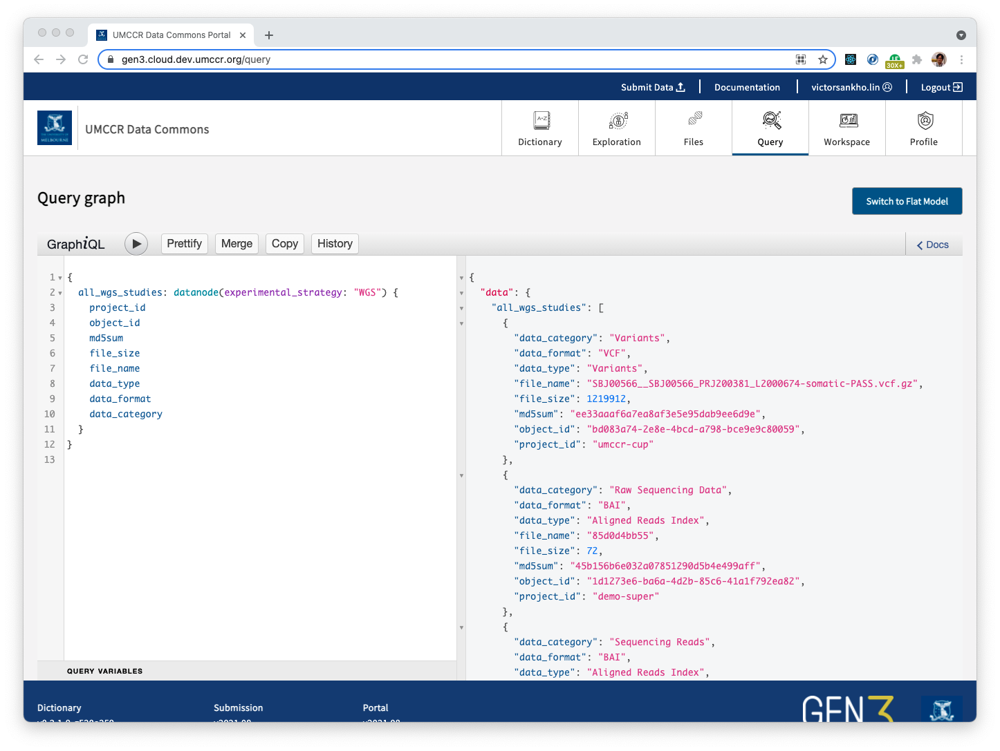

# Searching & Querying

## Context

In short, there are two major persistence data stores for querying submitted data in Gen3:
1. Indexd database
2. Graph metadata database

Indexd responsible for file object data indexes (i.e. where data actually sit). Graph metadata responsible for all metadata for the submitted file object such as Clinical meta-info, Demographic, Sequencing information, and all other terms and ontology.

Hence, possible actions you can make are:
1. Indexd query or GA4GH DRS query for globally unique identifier (GUID) of a file object
2. Graph query for meta-information searches

### Query Methods

- Index information query offer through REST API, including **GA4GH DRS** standard.
- Metadata query are mainly in **GraphQL syntax** with _some_ REST API queries for program and project node level.
 
The following official Gen3 documentation explains how to perform Graph metadata query: 
- https://gen3.org/resources/user/query-data/

## Research Questions

### Q1. How does data query look alike in Gen3?

Let go through with some examples.

#### Give me data files Object IDs (GUID) related to where Program name "umccr", Project code "cup" and Sample `tissue_type` (Phenotype) is "Tumor"

GraphQL looks like as follows. It basically walks-through node in the data dictionary graph.



```graphql
{
  program(name: "umccr") {
    name
    projects(code: "cup") {
      name
      code
      dbgap_accession_number
      investigator_name
      subjects {
        submitter_id
        samples(tissue_type: "Tumor") {
          submitter_id
          aliquots {
            read_groups {
              submitted_aligned_reads_files {
                submitter_id
                object_id
              }
              submitted_unaligned_reads_files {
                submitter_id
                object_id
              }
              submitted_somatic_mutations {
                submitter_id
                object_id
              }
            }
          }
        }
      }
    }
  }
}
```

#### Can you do an example syntax to get the same results but not mentioning Aliquots?

- We can't skip node, off the shelf.

- However, there can be 'custom' logical node resolver built for this kind of use case - such that, this custom node resolver is derivation of some  nodes in Data Dictionary (DD) Graph.

As an example:

- Current Gen3 comes built-in node called `datanode`. This is a custom node for GraphQL purpose (i.e. we do not model this node in metadata Graph). It builds on top of properties from Data File node category (+ some of its parent properties).
- Then, we can have a _cross-cut_ query like: **Give me all Object ID(s) where `experimental_strategy` is WGS (i.e. Assay Type is WGS)**



```graphql
{
  all_wgs_studies: datanode(experimental_strategy: "WGS") {
    project_id
    object_id
    md5sum
    file_size
    file_name
    data_type
    data_format
    data_category
  }
}
```

### Q2. Federated searches?

_a.k.a. Cross data warehouse searches or Cross Gen3 instance searches_

> Short answer is - _this is not possible by design_!

- To explain further, making it GraphQL API (hence, Graph data dictionary schema) is - a **Specific data model** or use case, rather than **General model** that fit all use cases.
- In fact, GraphQL is born out of how REST API deficient in expressiveness and related entities fetching.
- This also echo Gen3 Data Dictionary [design_notes.md](https://github.com/uc-cdis/datadictionary/blob/develop/design_notes.md)

Here are some key properties of GraphQL:

- Only 1 Graph (hence 1 endpoint). See https://principledgraphql.com/integrity
- Client/User express what properties its needs and, server response **_exactly_** just that.
- Related entitles fetching is basically a graph problem — i.e. it is up to _endpoint resolver_ to resolve graph node(s) and edges of some graph schema; data dictionary model and/or some logical node that derive from some base entities (as explained `datanode` in Gen3 in above ☝️).

> However, There can be a **Super Graph**!!

There are seemingly 2 techniques for answering GraphQL federated searches:
1. **Graph Schema Stitching**
2. **Gateway Graph Registry** that register (now become) sub-graph of some higher **Super Graph**

Hence, federated searches!

<details>
<summary>Supplementary Reading on GraphQL federation</summary>

The following are some articles and content regarding GraphQL federation. 

Articles:
- https://www.graphql-tools.com/docs/schema-stitching/stitch-combining-schemas
- https://www.apollographql.com/docs/federation/
- https://xebia.com/blog/graphql-federation-for-everyone/
- https://product.voxmedia.com/2020/11/2/21494865/to-federate-or-stitch-a-graphql-gateway-revisited

Managed Federation:
- https://www.apollographql.com/docs/federation/managed-federation/overview/

Netflix case study:
- [How Netflix Scales Its API with GraphQL Federation](https://www.youtube.com/watch?v=QrEOvHdH2Cg)
- https://netflixtechblog.com/how-netflix-scales-its-api-with-graphql-federation-part-1-ae3557c187e2
- https://netflixtechblog.com/how-netflix-scales-its-api-with-graphql-federation-part-2-bbe71aaec44a

</details>


## Summary

In summary, we can conclude that

1. _One_ Gen3 instance can have only **one** Data Dictionary model. Multiple Data Dictionary within a single domain (instance) is not possible, yet. 

2. Hence, the better we align different Gen3 Graph Data Dictionary models, the more streamline query we can make across Gen3 instances.

3. At broader high level, there need to have an agreement on **Baseline nodes** that should have (or must have). Then, additionally there can be **Secondary nodes** that enrich a more specific use case meta-information; on top of [Gen3 node type categorisation](https://gen3.org/resources/operator/#3-creating-a-new-data-dictionary) (i.e. Administrative, Biospecimen, Clinical, etc...)

4. As for higher national level needs of harmonisation, we could do one of those aforementioned techniques - schema stitch, super graph gateway & subgraph. Or, some higher **service layer** that encapsulate multiple Gen3 instances.
