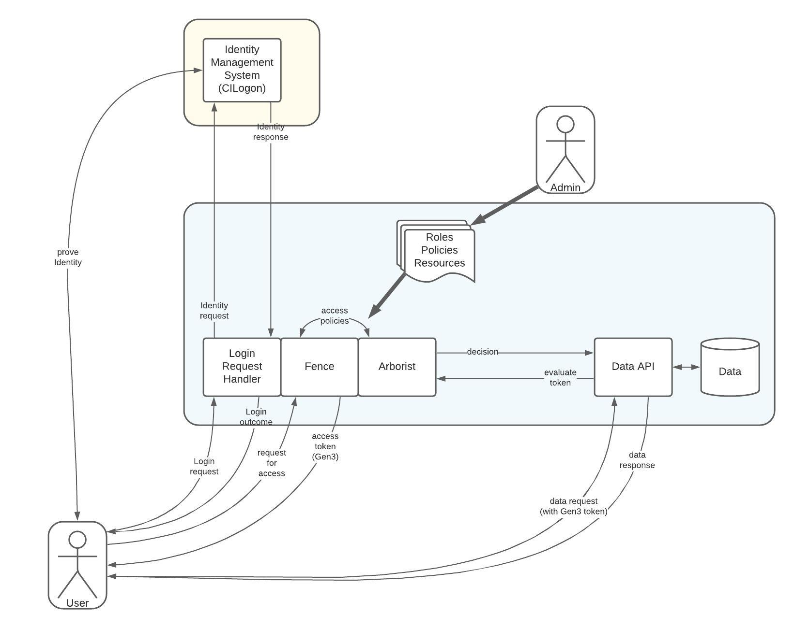
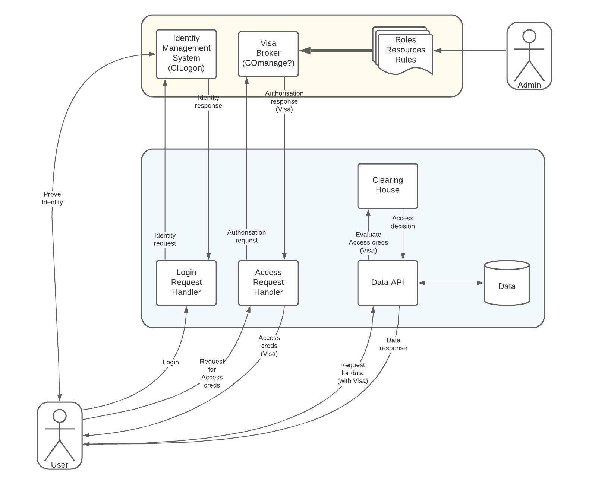
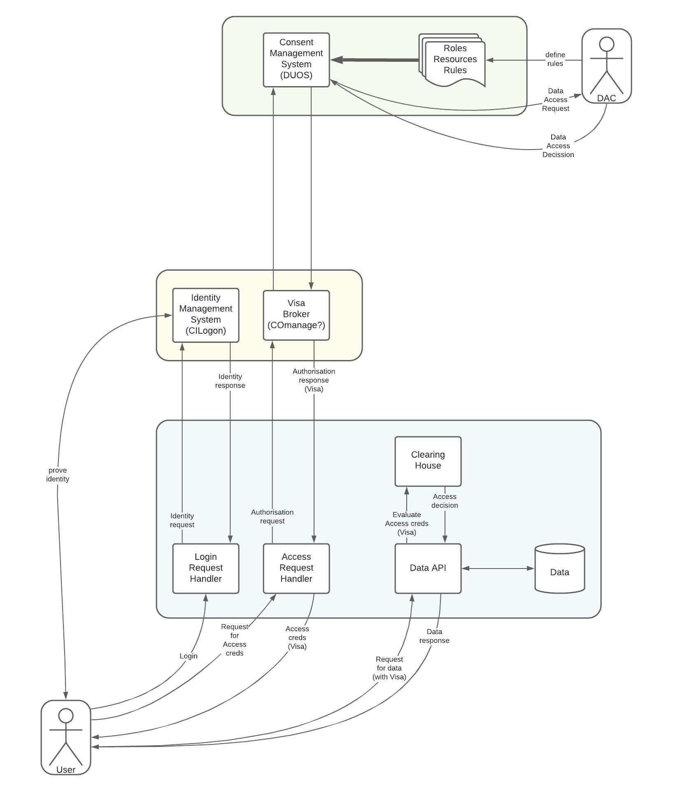

# Use Case 

Use Case example for the basic of workshop discussion around Gen3, GA4GH Passport and CILogon/COmanage. You can/may try this on [UMCCR Data Commons (DEV)](https://gen3.cloud.dev.umccr.org) which integrated with Identity Providers (IdP) Google and [AAF](https://aaf.edu.au) managed [CILogon](https://cilogon.org)/[COmanage](https://incommon.org/software/comanage/).


## As a Researcher

**Context:**

- There exist data submission to UMCCR Data Commons (DEV) under [UMCCR program's CUP project][1]
- I have submitted 1 experimental metadata and, I know this data file GUID — [following data submission][2]
- I wish to access this metadata file by using its GUID (say, part of workflow launching into WES for analysis or data sharing purpose)
- I know, I can download it from [Portal directly using its GUID][3]
- However, I want to access it programmatically and, using GA4GH DRS API standard — [so follow using API guide][4]

[1]: https://gen3.cloud.dev.umccr.org/umccr-cup
[2]: https://github.com/umccr/gen3-doc/blob/main/user-guide/submit-data.md
[3]: https://gen3.cloud.dev.umccr.org/files/f5c4e255-2bbf-4026-9fbd-4dec3ae5f886
[4]: https://github.com/umccr/gen3-doc/blob/main/user-guide/using-api.md

**At the moment:**

- I create JWT token from Fence token endpoint using long-term "API Key" [credentials downloaded from Portal UI][5]
- Using [`gen3_decode.R`][6], I can inspect Fence's issued token details and what it contains such as scopes, expires, etc and, optionally I can verify the JWT if I want to...

```
...
"scope":["data","user","fence","openid"]
...
Issues  At: 2021-05-20 12:54:00
Expires At: 2021-05-20 13:54:00
```

[5]: https://github.com/umccr/gen3-doc/blob/main/user-guide/using-api.md#getting-bearer-token
[6]: https://github.com/umccr/gen3-doc/blob/main/user-guide/using-api.md#token-details

**Next:**

- I can query to _**Get DRS Object by GUID**_ and it is known to be accessible publicly
```
curl -s https://gen3.cloud.dev.umccr.org/ga4gh/drs/v1/objects/f5c4e255-2bbf-4026-9fbd-4dec3ae5f886 | jq
```

- Next, using my (Fence's issued) JWT token, I can get downloadable "Singed URL" — i.e. _**Get a (signed) URL for fetching DRS Object bytes**_

```
curl -s -H "Authorization: Bearer $GEN3_TOKEN" https://gen3.cloud.dev.umccr.org/ga4gh/drs/v1/objects/f5c4e255-2bbf-4026-9fbd-4dec3ae5f886/access/s3 | jq
```

- Then, from my workflow script, I can fetch the data file


## As a ADMIN

In order to make above Use Case scenario to work:

- I have to configure [Fence `user.yaml` config file](https://github.com/uc-cdis/fence/blob/master/docs/user.yaml_guide.md) and, [update it to Fence database](https://github.com/uc-cdis/cloud-automation/blob/master/kube/services/jobs/README.md#usersync-job) (which in turn call [Arborist](https://github.com/uc-cdis/arborist) as its _**Access Policy Engine**_ to populate and store roles, policies, etc).
- This `user.yaml` update process is carried out manually i.e.
    - I'll have to add any new user
    - I'll have to add resources (program/project), policies and roles that enforce data governance
- Please see [attached `user.yaml`](user.yaml) for example Fence User config
- Please see [attached `fence-config.yaml`](fence-config.yaml) for example Fence config

**NOTES:**

- This `user.yaml` update process can, however, be scheduled update (cron job) or event trigger (e.g. after uploaded to S3 bucket).
- Username `foo.bar@umccr.org` denotes login identity using _**UMCCR Google GSuite**_
- Username `foo.bar` denotes login identity using UniMelb account through _**CILogon/COmanage AAF**_
- Both login identities have access policies to:
```
    policies:
    - data_upload
    - workspace
    - jnkns
    - MyFirstProject_submitter
    - program1
    - umccr
    - zero
```

Here, Policy ID `umccr` apply to any resources under `/programs/umccr` such as `/programs/umccr/projects/cup` for example.


## Discussion

- How to facilitate users, groups, roles, policies provisioning into Fence/Arborist? In automated way from central AAI/IdP body (AAF/CILogon/COmanage), after user authenticated/login?
- How to incorporate a more specialised [GA4GH Passport Visa Token -- Researcher ID](https://github.com/ga4gh-duri/ga4gh-duri.github.io/tree/master/researcher_ids)? (instead of Fence's standard OIDC JWT)
- Consent Management System and Data Access Committees (DACs)

**_Terms:_**
- **AAI** - Authentication and Authorization Infrastructure
- **IdP** - Identity Provider
- **DAC** - Data Access Committees
- **OIDC** - OpenID Connect - _protocol_
- **JWT** - JSON Web Token - _claims format_

### Diagram

#### What is happening now...

The following [Gen3-Authn-Authz-stage-1.jpeg](img/Gen3-Authn-Authz-stage-1.jpeg) depict current AuthN/AuthZ flow.



#### Some short-term goal, perhaps...

The following [Gen3-Authn-Authz-stage-2.jpeg](img/Gen3-Authn-Authz-stage-2.jpeg) depict _**one possible**_ AuthN/AuthZ flow with Passport Visa broker.




#### Ultimate goal!

The following [Gen3-Authn-Authz-stage-3.jpeg](img/Gen3-Authn-Authz-stage-3.jpeg) envision the ultimate AuthN/AuthZ flow with Passport Visa broker + Consent Management System (such as [DUOS](https://duos.broadinstitute.org)) and DAC. 


